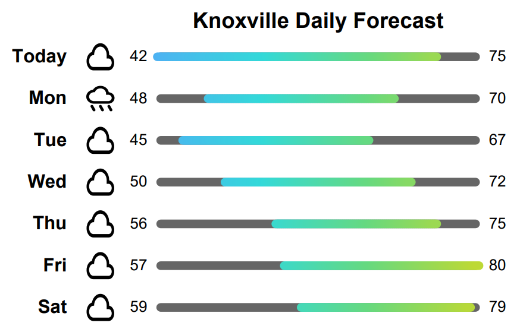

# jgraph
COSC594 (S26) Lab 1

This porgram takes in decimal coordinates, retrieves the weather forecast for the next week, and outputs a Jgraph to standard out that visualizes the temperature ranges for each day and the expected weather condition.

This program has been tested on Ubuntu and Ubuntu (WSL).

## Compiling
Requirements
- go 1.24.4 or later
- jgraph
- ps2pdf

To compile, run `make build`. If you want to compile manually, run `go build -buildvcs=false -o ./weather ./src`.

## Running
To use the program, simply pass in coordinates: `./weather <latitude> <longitude>`.  
For example, Knoxville's coordinates are: 35.9617° N, 83.9232° W, so that would be inputted as 35.9617 -83.9232. North and East are positive and South and West are negative.  
The output of the program is jgraph, which needs to be piped to jgraph to get postscript.

For a set of examples, run `make` or `make runall`. This will produce a set of pdf's in the ./out folder.
